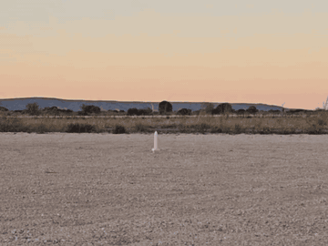
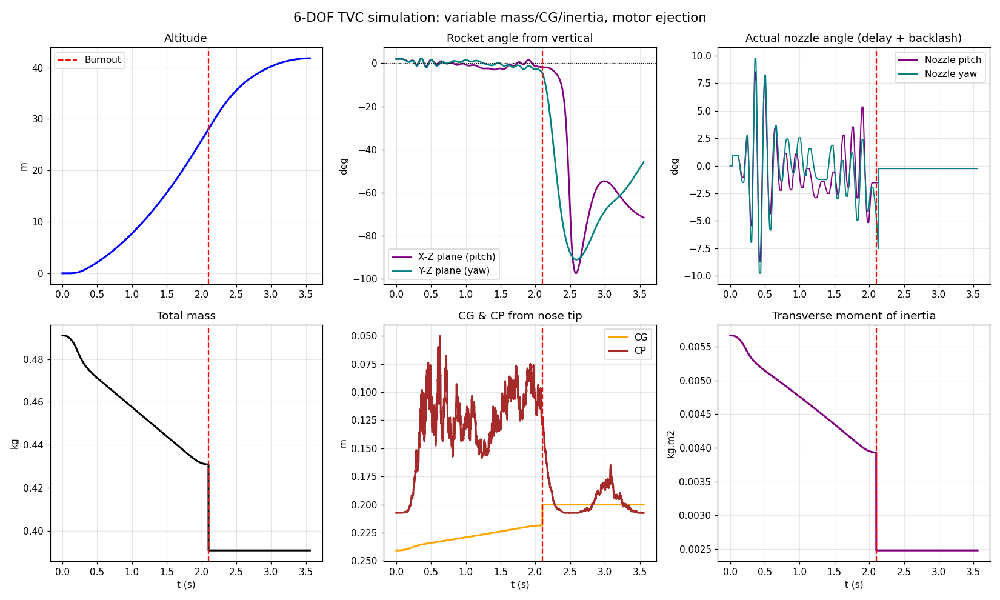
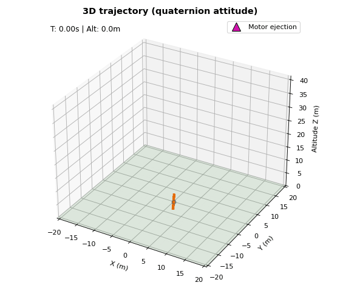
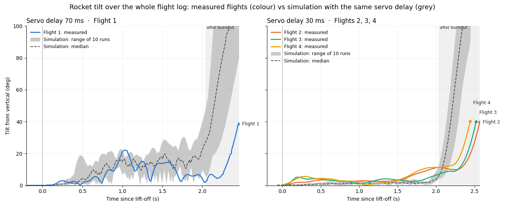
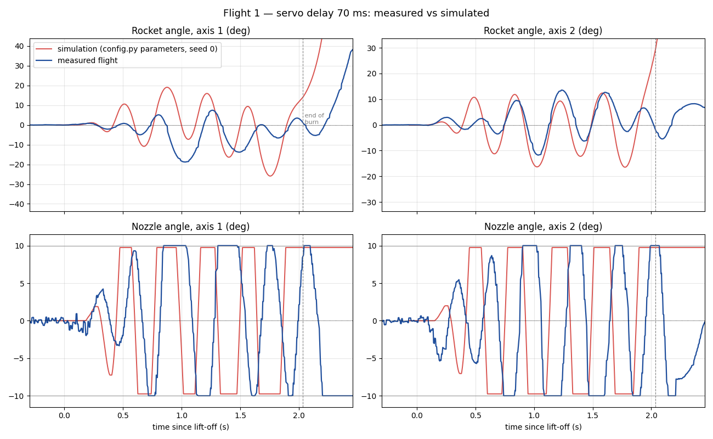
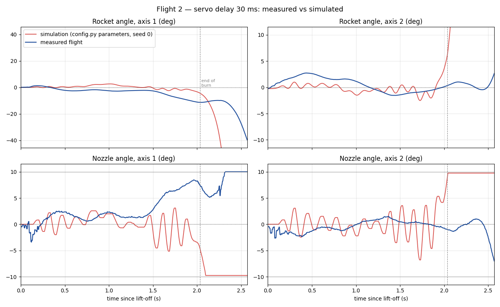
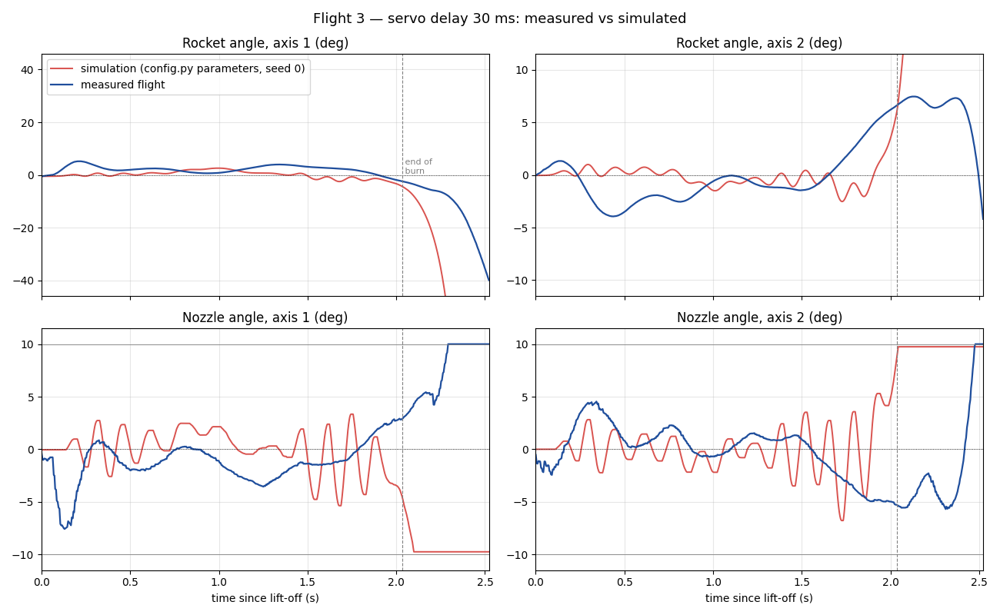
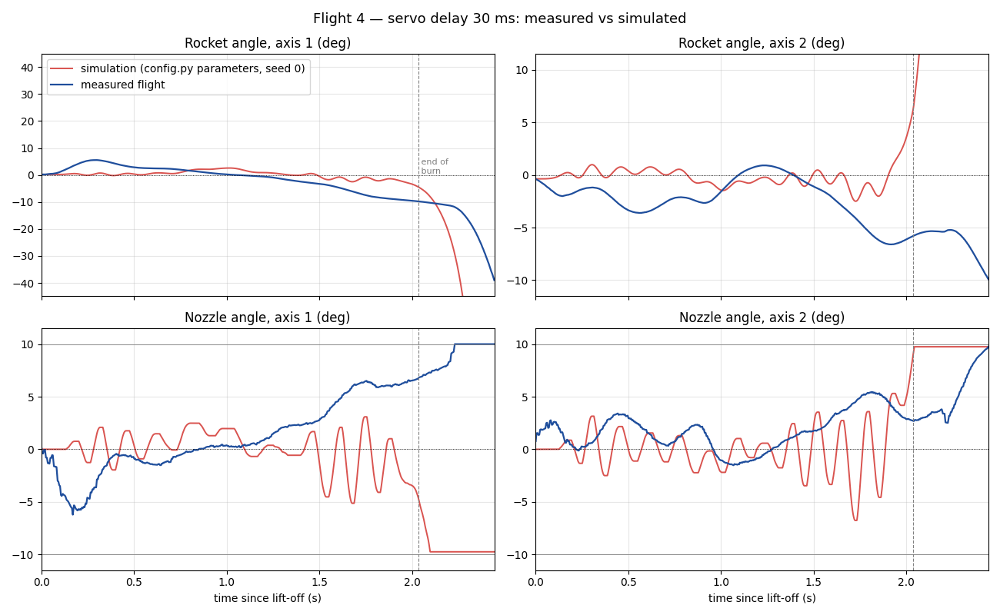

<p align="center"></p>

# 6DDL_TVC — 6-DOF simulator for a thrust-vector-controlled model rocket

[](https://github.com/AxelBoularot/6DDL_TVC/actions/workflows/tests.yml)


A 6-degree-of-freedom flight simulator for a small rocket stabilised by a gimballed
motor nozzle (TVC), with quaternion attitude, variable mass, a realistic servo chain
(gear ratio, end stops, delay, mechanical backlash), gusty wind, motor ejection and
parachute. Pure Python (NumPy + Matplotlib), easy to read and to modify.

**A STAR project.** STAR is a group of people who set out to build every project
that comes to mind. This simulator was written to design and tune the TVC of our
model rockets, and it is checked against their real flight logs.

<p align="center">
  <a href="docs/second_flight.mp4"></a><br>
  <em>Second TVC flight (flight 2, servo delay 30 ms). Click the image for the video.</em>
</p>



<p align="center"></p>

## Quick start

```bash
git clone https://github.com/AxelBoularot/6DDL_TVC.git
cd 6DDL_TVC
pip install -r requirements.txt
python main.py                 # simulate to apogee, plots + 3D animation
```

Every run also saves the 3D animation as a GIF in `sorties/animation_3d.gif`
(or in the `--save` folder).

| Option | Effect |
|---|---|
| `--sol` | simulate down to the ground (motor ejection, parachute) instead of stopping at apogee |
| `--combustion` | stop the simulation at the end of the burn |
| `--seed N` | reproducible wind gusts and torque noise |
| `--no-anim` | plots only, no 3D window |
| `--save DIR` | save the plots (PNG) and the 3D animation (GIF) in `DIR`, no window |
| `--no-gif` | do not save the 3D animation as a GIF |
| `--comparer` | compare the real flights in `vols/` with the simulator (figures + README table) |

Switches at the top of `config.py`: `STOP_A_APOGEE`, `STOP_FIN_COMBUSTION` (stop at burnout),
`COUPER_TVC_FIN_COMBUSTION` (at burnout the PID is switched off and the nozzle returns to centre),
`EJECT_MOTOR`, `DEPLOY_PARACHUTE`, `USE_ISA`, `SEED`.

Every physical parameter is in **`config.py`** (PID gains, geometry, masses,
aerodynamics, TVC chain, wind, thrust curve, ejection, parachute).

## What is modelled

- **Rigid body, 6 DOF.** Translation in the world frame, rotation in the body frame
  (Euler's equations with the gyroscopic term), attitude as a unit quaternion
  (Hamilton, body → world), renormalised every step.
- **Variable mass.** Propellant mass follows the burnt impulse; mass, centre of
  gravity and transverse inertia are updated every step; the empty motor casing can
  be ejected at burnout.
- **Thrust vector control.** Two independent PID loops (pitch, yaw) on the attitude
  error measured in the body frame, with anti-windup. The command goes through the
  real mechanical chain:
  `PID → desired nozzle angle → × gear ratio → servo (end stop) → delay → ÷ ratio → backlash → nozzle`.
- **Aerodynamics.** Extended Barrowman body model (potential nose term + viscous
  cross-flow term), pitch damping, drag (or parachute drag after deployment).
- **Environment.** ISA air density, horizontal gusts (Ornstein–Uhlenbeck process),
  random disturbance torque independent of the time step.
- **Events.** Lift-off only when thrust exceeds weight (no launch rail), motor ejection
  impulse on the motor cross-section, parachute at apogee.

## Code layout

```
6DDL_TVC/
├── main.py              command-line entry point
├── config.py            all parameters and switches
├── simulateur/          the simulator package
│   ├── simulation.py    main loop (assembles the modules); simuler() returns the time history
│   ├── dynamique.py     rigid-body state and one 6-DOF integration step
│   ├── quaternions.py   quaternion algebra, attitude integration, attitude errors, tilt
│   ├── tvc.py           PID, ChaineServo (ratio, end stop, delay, backlash), ControleurTVC, vectored thrust
│   ├── aero.py          normal force, pitch damping, drag / parachute
│   ├── moteur.py        thrust curve (time-interpolated), impulse, propellant mass
│   ├── masse.py         variable mass, CG and inertia
│   ├── environnement.py air density, wind gusts, disturbance torque
│   ├── evenements.py    lift-off, motor ejection, parachute, stop conditions
│   ├── historique.py    time-history recording
│   ├── affichage.py     2D plots and 3D animation
│   └── vols_reels.py    real flight logs vs simulation (figures, README table)
├── vols/                flight-computer logs + vols.json (servo delay of each flight)
├── tests/               unit and integration tests (python -m pytest)
└── docs/                figures and flight video used in this README
```

Use it from your own script (run from the repository root), e.g. for gain tuning or
Monte Carlo runs:

```python
from simulateur import simuler
hist, evts, motor = simuler(seed=0, verbeux=False)
print(hist['z'].max(), hist['tilt'].max())
```

## Conventions

- World frame: Z up (altitude), gravity (0, 0, −g).
- Body frame: the nose points along +z_b; stations along the body are measured from the nose.
- Angles in `config.py` and in the plots are in degrees; everything else is SI.

## Limitations

- Semi-implicit Euler integration with a fixed step (1 ms by default).
- No fins in the aerodynamic model: without thrust the rocket is not aerodynamically stable.
- No launch rail, no roll control, no İω or jet-damping terms.
- Pitch damping from the nose term only (no body cross-flow damping); drag coefficient
  constant; aerodynamic coefficients entered by hand in `config.py`.
- No servo speed limit: the servo reaches its command after the delay, instantly.
- The backlash model assumes the nozzle stays where it was last pushed.
- Parameters are those of one specific rocket: measure your own (mass, CG, inertia,
  nozzle position, servo delay, backlash) before trusting the results.

## Real flights vs simulation

The flight-computer logs in `vols/` are replayed in the simulator with the same servo
delay and the same initial attitude, then compared. The per-flight figures show one run
with the `config.py` parameters (seed 0). Wind gusts and disturbance torque are random, so
each flight is also simulated 10 times: the summary figure shows the spread of these runs
(grey band and median), and the table gives the base run with the 10-run min–max in
brackets. Regenerate everything (figures and the table below) with:

```bash
python main.py --comparer
```

**Adding a flight:** copy the log into `vols/` and add an entry to `vols/vols.json`
(`nom`, `fichier`, `servoDelay`, optional `t_decollage` = lift-off time in the log, in s,
`signe` = sign convention of the flight computer). Log format, no header, `;` separator:
`time_ms ; temperature_C ; pressure_hPa ; angle_1 ; angle_2 ; nozzle_1 ; nozzle_2`.

<!-- COMPARAISON:DEBUT -->

From lift-off to burnout (2.04 s), **measured** / simulated:

| Flight | Servo delay | Max tilt | Oscillation (RMS rate, °/s) | Nozzle at end stop | Altitude at burnout |
|---|---|---|---|---|---|
| Flight 1 | 70 ms | **22.2°** / 32.4 (22.2–47.4)° | **150** / 212 (171–214) | **52 %** / 66 (53–79) % | **17.5 m** / 25.3 m |
| Flight 2 | 30 ms | **11.3°** / 7.4 (4.0–12.5)° | **12** / 26 (18–28) | **0 %** / 0 (0–2) % | **16.6 m** / 28.2 m |
| Flight 3 | 30 ms | **7.0°** / 7.4 (4.0–12.4)° | **20** / 26 (18–29) | **0 %** / 0 (0–2) % | **18.3 m** / 28.2 m |
| Flight 4 | 30 ms | **11.4°** / 7.5 (4.0–12.5)° | **17** / 26 (18–27) | **0 %** / 0 (0–2) % | **17.4 m** / 28.2 m |

Simulated values: the run with the `config.py` parameters (the flight's servo delay and initial attitude, seed 0), shown in the per-flight figures; in brackets, the min–max over 10 runs with random wind gusts and disturbance torque (grey band of the summary figure).



<details><summary>Flight 1 — first TVC flight, servo delay 70 ms</summary>



</details>

<details><summary>Flight 2 — servo delay 30 ms</summary>



</details>

<details><summary>Flight 3 — servo delay 30 ms</summary>



</details>

<details><summary>Flight 4 — servo delay 30 ms</summary>



</details>

<!-- COMPARAISON:FIN -->

**Lift-off alignment.** The nozzles move before lift-off (servos armed), but the
attitude does not change while the rocket sits on the pad. Lift-off is therefore the
start of free rotation: smoothed angular rate above 10 °/s for 50 ms, traced back to the
last instant it was below 3 °/s. On flight 1 the board steered for 0.4 s on the pad; the
logs of flights 2–4 start at lift-off (the board triggers the log). The barometer is only
a check: with its 0.1 hPa (≈ 0.85 m) steps it sees the climb 0.1–0.3 s late. Lift-off can
be forced with `t_decollage` in `vols.json`.

**What the first four flights show**

- The 70 ms servo delay of flight 1 is the cause of its oscillation. The simulator run
  with 70 ms reproduces a limit cycle of the same period (0.37 s simulated, 0.32–0.40 s
  measured) with the nozzle hitting its end stops; with 30 ms both the real flights and
  the simulation stay stable.
- The measured maximum angles fall inside the simulated ranges (22° in 22–47° at 70 ms,
  7–11° in 4–12.5° at 30 ms), but the simulator's disturbances (gusts, torque noise) are
  generic, not measured.
- Flights 2–4 drift slowly on axis 1 during the burn and the nozzle holds a growing
  offset: a steady disturbing torque (thrust misalignment or CG offset) that the
  simulator does not model yet.
- The real rocket climbs slower than the simulated one (about 17 m vs 28 m at burnout):
  thrust or mass in `config.py` should be recalibrated. Drag has little effect at these
  speeds (Cx 0.5 → 1.5 only lowers it from 28 to 26.6 m), whereas 20 % less thrust gives
  18.8 m and 0.1 kg more mass 19.9 m.
- The figures cover the whole flight log, burnout included. After burnout the simulated
  rocket tumbles much faster than the real one (past 90° about 0.3 s after burnout,
  versus about 40° at the end of the real logs, 0.4–0.5 s after burnout): the motor
  ejection kick and the lack of fins in the model are the first things to check.

## Tests

```bash
pip install pytest
python -m pytest
```

## Licence

MIT — see [LICENSE](LICENSE).

---

## 🇫🇷 En bref

Un projet du groupe **STAR**, un groupe de personnes qui veulent réaliser tous les
projets qui leur passent par la tête.

Simulateur 6 DDL d'une fusée stabilisée par tuyère orientable (TVC) : attitude par
quaternions, masse/CG/inertie variables, chaîne servo réaliste (rapport, butée,
retard, jeu), vent en rafales, éjection du moteur et parachute. Tous les réglages
sont dans `config.py`. Lancer : `python main.py` (arrêt à l'apogée) ou
`python main.py --sol` (jusqu'au sol).
